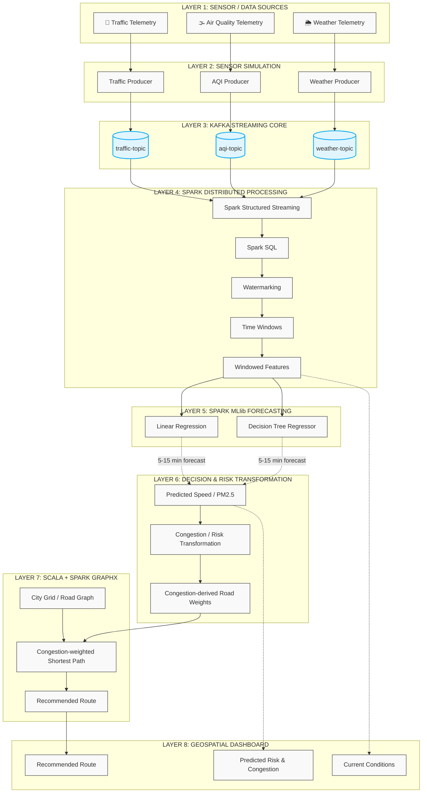

<div align="center">

# 🏙️ Urbanix
**Smart City IoT Traffic & Environmental Risk Forecasting Platform**


*A distributed Kafka + Spark platform for streaming urban telemetry, forecasting localized traffic and environmental risk, and supporting congestion-aware route planning.*

</div>

## 📖 Overview
Urbanix is a distributed, event-driven smart-city analytics platform. Built incrementally as an academic Cluster Computing capstone, it explores the foundations of distributed streaming, machine learning forecasting, and graph processing.

### ❓ Problem Statement
Modern smart cities generate massive volumes of telemetry (traffic density, air quality, weather conditions). Processing this in real-time to forecast risk and dynamically reroute traffic requires a robust, fault-tolerant distributed architecture. Urbanix serves as a demonstrator for these concepts using a local, standalone cluster.

## 🏗️ High-Level Architecture
Urbanix processes data through a structured pipeline:
1. **Ingestion:** Python producers simulate/replay JSON sensor events to Kafka.
2. **Stream Processing:** PySpark Structured Streaming ingests events, applying watermarking and windowed aggregations.
3. **Forecasting:** Spark MLlib predicts near-future traffic speed and pollution (PM2.5) levels.
4. **Graph Routing:** Predictions are converted to congestion-derived road weights, mapped onto a city grid, and processed by Scala Spark GraphX to find optimal routes.
5. **Visualization:** A geospatial dashboard visualizes current and predicted states.

### 🏗️ End-to-End System Architecture
Urbanix follows an event-driven pipeline in which simulated/replayed traffic, air-quality, and weather telemetry are ingested into Kafka, processed using Spark Structured Streaming and SQL, transformed into forecasting features, passed through Spark MLlib for short-horizon prediction, converted into congestion-aware road weights, processed by Scala Spark GraphX, and presented through a geospatial dashboard.

**Target end-to-end architecture:**



**Core Prediction to Routing Flow:**
```text
Predicted Speed / PM2.5
          ↓
Congestion-derived Road Weights
          ↓
Congestion-weighted Shortest Path
          ↓
Recommended Route
          ↓
Geospatial Dashboard
```

### 📦 The Six Core Modules
| Module | Purpose | Technology | Status |
|---|---|---|---|
| **M1 — Sensor Simulation Layer** | Generates telemetry (Traffic, AQI, Weather) | Python | 📅 Planned (Day 2) |
| **M2 — Kafka Streaming Core** | Event ingestion and message brokering | Apache Kafka | 📅 Planned (Day 1) |
| **M3 — Structured Streaming + SQL** | Real-time aggregation & feature engineering | PySpark | 📅 Planned (Days 3-6) |
| **M4 — Spark MLlib Forecasting** | ML models for predicting traffic and pollution | Spark MLlib | 📅 Planned (Days 4-6) |
| **M5 — Scala Spark GraphX Rerouting** | Congestion-aware shortest-path calculations | Scala, GraphX | 📅 Planned (Days 7-9) |
| **M6 — Geospatial Dashboard** | Visualization and API layer | FastAPI, Folium | 📅 Planned (Days 10-11) |

## 🛠️ Technology Stack
<details>
<summary><b>View Tech Stack</b></summary>

- **Languages:** Python 3.10+, Scala
- **Streaming & Messaging:** Apache Kafka, Zookeeper
- **Stream Processing:** PySpark Structured Streaming, Spark SQL
- **Machine Learning:** Apache Spark MLlib (Linear Regression, Decision Tree Regressor)
- **Graph Processing:** Scala, Apache Spark GraphX
- **Infrastructure:** Docker, Docker Compose
- **Visualization / API:** FastAPI or Flask, Folium / Plotly
- **Storage:** Parquet
</details>

## 🗺️ 12-Day Roadmap
* **Days 1–3: Data Pipeline**
  * Day 1: Environment + Repo Setup
  * Day 2: Sensor Simulation Producers
  * Day 3: Spark Streaming + SQL + Watermarking
* **Days 4–6: ML Forecasting**
  * Day 4: Feature Engineering + Chronological Split
  * Day 5: Linear Regression + Decision Tree + Metrics
  * Day 6: Live Inference + Checkpointing
* **Days 7–9: GraphX Rerouting**
  * Day 7: Scala/sbt + Road Graph
  * Day 8: Congestion-weighted Shortest Path
  * Day 9: GraphX Integration
* **Days 10–12: Dashboard + Defense**
  * Day 10: FastAPI + Geospatial Visualization
  * Day 11: Reroute Overlay + Fallback + Fault Tolerance
  * Day 12: Report Finalization + Viva

## 📊 Current Implementation Status
**Current Phase: Day 1 — Environment + Repository + Local Infrastructure**
- [x] **Repository:** Complete
- [x] **Environment verification:** Complete
- [x] **Monorepo:** Complete
- [ ] **Infrastructure:** Not started
- [ ] **Kafka topics:** Not created yet
- [ ] **Sensor producers:** Planned
- [ ] **Spark streaming:** Planned
- [ ] **MLlib forecasting:** Planned
- [ ] **GraphX routing:** Planned
- [ ] **Dashboard:** Planned

## 📁 Repository Structure
- `services/`
  - `producers/` - Sensor data generation
  - `streaming/` - PySpark processing & ML forecasting
  - `graphx-reroute/` - Scala GraphX routing engine
- `dashboard/` - API and geospatial visualizations
- `infra/` - Docker Compose configuration
- `data/` - Datasets (Parquet/JSON)
- `docs/` - Architecture and project documentation
- `.github/workflows/` - CI automation (Planned)

## 🎓 Learning & Engineering Philosophy
Urbanix is intentionally built incrementally. Each stage focuses on reproducibility, observable milestones, and meaningful Git commits. We emphasize understanding distributed-system fundamentals, fault tolerance, and explainability for academic defense over deploying a production-ready application.

### ⚠️ Scope and Limitations
- Uses simulated/replayed public or historical data.
- Maps to a defined city-grid/road network.
- Operates on a local standalone cluster (no cloud/Kubernetes).
- Designed purely as a distributed streaming demonstration, forecasting, and routing capstone.

## ⚖️ License
This project is licensed under the MIT License.

<div align="center">
<hr>
<b>Urbanix</b><br>
<i>Smart City IoT Traffic & Environmental Risk Forecasting Platform</i><br>
Built as an academic Cluster Computing capstone.<br>
<br>
</div>
