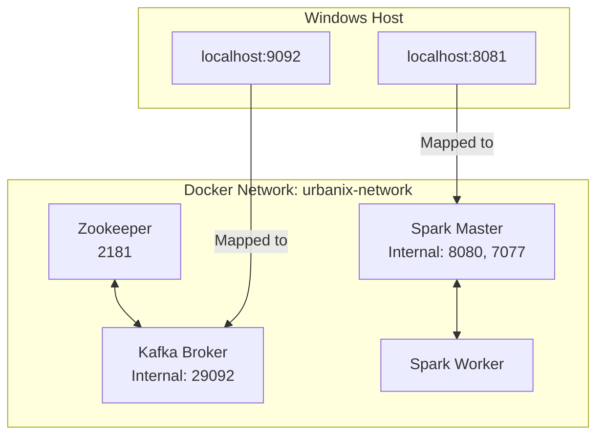

# 🌆 Urbanix — Day 1 Infrastructure Deep-Dive
> **From Local Environment Setup to a Verified Kafka + Spark Distributed Foundation**

> [!WARNING]
> **TEMPORARY DEVELOPMENT NOTE**
> This document exists to preserve Day 1 learning and implementation history. It is intentionally stored under `_day-notes/` and is planned to be removed before final project submission.

---

## 🎯 1. Day 1 Objective

**Urbanix** is a Smart City IoT Traffic & Environmental Risk Forecasting Platform built as an academic capstone. It leverages powerful distributed systems (Kafka for messaging, Spark for processing) to ingest massive amounts of telemetry data and process it using machine learning and graph algorithms.

### ❓ Why Start with Infrastructure?
**Day 1 Objective:** Establish the fundamental infrastructure scaffold upon which the rest of the project will run. We needed a clean monorepo, a robust local Git history, and a completely localized Docker Compose environment running Zookeeper, Kafka, and a standalone Spark cluster.

Infrastructure comes *before* writing application logic. Why? Because distributed streaming code (like Python producers or Spark streaming jobs) physically requires a cluster to connect to. Building the cluster first allows us to verify networking and architecture independent of application bugs. If a Python script fails tomorrow, we know it is a script error, not a missing Kafka broker.

**What was NOT built (Day 1 Boundary):**
- *Planned / Discussed — Not Implemented on Day 1:*
  - Python sensor producers
  - Spark Structured Streaming applications
  - Spark SQL
  - MLlib / ML models
  - Scala / GraphX
  - FastAPI
  - The frontend dashboard

---

## 🛠️ 2. Technologies Used

| Technology | Version / Image | Purpose in Urbanix |
| :--- | :--- | :--- |
| **Docker** | Verified working version | Container runtime to run isolated services (Kafka, Spark) without cluttering your OS. |
| **Docker Compose**| Verified working version | Multi-container orchestration (boots everything with one command). |
| **Java** | JDK 25.0.2 LTS | JVM ecosystem required for future Spark/Scala compatibility on your host. |
| **Git** | Verified working version | Version control to track changes safely. |
| **Zookeeper** | `confluentinc/cp-zookeeper:7.5.0` | Kafka coordination. It keeps track of the Kafka broker's state. |
| **Kafka** | `confluentinc/cp-kafka:7.5.0` | The event streaming backbone. It receives and holds data until Spark reads it. |
| **Spark** | `apache/spark:3.5.1` | The distributed processing engine that will perform analytics. |
| **GitHub** | Repository | Remote version control to back up our work. |

*(Note: Python and Java are not strictly used by the Day 1 Docker containers internally, but they are crucial host environment dependencies validated for future days).*

---

## 🔍 3. Environment Verification

Before installing infrastructure, we meticulously verified the host machine's readiness. 

**Commands Used:**
```cmd
docker --version
docker compose version
python --version
java -version
javac -version
git --version
```
**Explanation:** 
These checks ensure the underlying executable binaries are in your system's `PATH`. A missing dependency (like Docker) would halt the infrastructure before it even started. This guarantees we have the right tools ready.

---

## ☕ 4. Java Version Issue / Environment Decision

During initial checks, we discovered **Java 8** was the active JDK, but **JDK 25.0.2 LTS** and JDK 23 were also installed on your machine. 

**Decision:** We selected JDK 25.0.2 LTS for Urbanix.
**Constraint:** We deliberately did **NOT** uninstall Java 8 because it is required for older legacy projects you are maintaining on your machine.

**Why Java matters:** Spark is written in Scala, which runs on the Java Virtual Machine (JVM). Having a robust, modern JDK is highly recommended for Spark development to avoid bizarre compatibility errors.

**How we switched the session safely:**
```cmd
set JAVA_HOME=C:\Program Files\Java\jdk-25.0.2
set PATH=%JAVA_HOME%\bin;%PATH%
```
By setting the `JAVA_HOME` environment variable and prepending it to the `PATH` in the command prompt, we force the terminal to prioritize JDK 25 over Java 8 *only for this session*. This avoids modifying system-wide global variables, preserving backward compatibility for your other projects.

---

## 📂 5. GitHub + Repository Setup

We chose a **monorepo** structure. 
*What is a monorepo?* It is a single Git repository containing all services, infrastructure, documentation, and data, rather than splitting them into ten different repositories. 
*Why?* This reduces complexity for an academic capstone, making it exponentially easier to track cross-cutting changes (e.g., updating a Kafka topic config in `infra` alongside the Python producer code in `services/producers` that uses it).

**Top-Level Directories & Their Purposes:**
- `services/producers`: Where we will write Python IoT data generators.
- `services/streaming`: Where we will write Spark Structured Streaming logic.
- `services/graphx-reroute`: Where we will write Scala/GraphX routing logic.
- `dashboard`: Where the future frontend application will live.
- `infra`: Where our Infrastructure-as-code (Docker Compose) lives.
- `data`: Where local data storage and checkpoints will be saved.
- `docs`: Where official project documentation is stored.
- `.github/workflows`: Where future CI/CD pipelines will go.

*Note: Most application directories are currently placeholders.*

---

## 📜 6. Git History

We deliberately used meaningful **Conventional Commits** (like `feat:`, `docs:`, `chore:`) rather than artificial/no-op commits. This shows professionalism in your capstone.

The defining commit of Day 1 Infrastructure was:
`78e4c29 feat(infra): add local Kafka and Spark cluster`

**Why it matters:** This commit cleanly scopes the introduction of the entire Docker infrastructure. It was pushed directly to `origin/main` from a clean working tree. Prior to this, several `docs:` and `chore:` commits were used to scaffold the initial directories and establish polished `README.md` files for every module.

---

## 🐳 7. Docker Fundamentals

Let's break down Docker concepts simply:

- **Docker image:** A read-only template with instructions for creating a Docker container (e.g., `apache/spark:3.5.1`).
  - *Data Science analogy:* A frozen Anaconda environment or a exported `.pkl` model file. It doesn't "run" on its own.
- **Docker container:** A runnable instance of an image (e.g., `spark-master`).
  - *Data Science analogy:* An actively running Jupyter Notebook kernel utilizing that environment.
- **Docker Compose:** A tool for defining and running multi-container Docker applications simultaneously.
  - *Real-world analogy:* A musical conductor coordinating different musicians (containers) to play a song together perfectly in sync.
- **Docker network:** An isolated virtual network that allows containers to talk to each other securely without exposing themselves to the outside world unnecessarily.
- **Container port:** The internal port exposed *inside* the isolated container.
- **Host port:** The external port exposed on your Windows machine, mapped directly to the container port so you can access it.

---

## 🏗️ 8. Urbanix Day 1 Architecture

### Mermaid Diagram


### ASCII Diagram
```text
Windows Host
 │
 ├── localhost:9092 → Kafka
 │
 └── localhost:8081 → Spark Master UI
 │
Docker Network (urbanix-network)
 │
 ┌───────────────┼────────────────┐
 │               │                │
Zookeeper      Kafka         Spark Master
                 │                │
                 │           Spark Worker
 └───────────────┴────────────────┘
```

---

## 🦓 9. Zookeeper

**What it is:** A centralized service for maintaining configuration information, naming, and providing distributed synchronization.
**Why we use it:** Our specific Kafka image (`confluentinc/cp-kafka:7.5.0`) uses Zookeeper to manage broker state, leader election, and metadata. Kafka asks Zookeeper "Who is in charge right now?".
**Port:** `2181`
*Why no KRaft?* While Kafka is moving towards Zookeeper-less architectures (KRaft), this specific stable Confluent image utilizes Zookeeper. We are optimizing for Day 1 stability and learning fundamentals.

---

## 📨 10. Kafka Broker

Let's define the Kafka ecosystem:
- **Broker:** A single Kafka server that stores and serves messages. It is the heart of Kafka.
- **Producer:** An application that writes data to Kafka. *(Planned - Not Implemented)*
- **Consumer:** An application that reads data from Kafka. *(Planned - Not Implemented)*
- **Topic:** A named category/feed to which messages are published (like a database table).
- **Partition:** A topic is split into partitions for horizontal scaling. If a topic is a highway, partitions are the lanes.
- **Replication Factor:** How many copies of data exist across brokers to prevent data loss.
- **Leader:** The broker actively handling reads/writes for a specific partition.
- **ISR (In-Sync Replica):** Replicas (backups) that are fully caught up with the leader.

*Example Flow:* A Python Traffic Sensor (Producer) will write to `traffic-topic` stored on the Kafka Broker, to be read milliseconds later by a Spark Streaming Consumer.

---

## 🚥 11. Why Three Kafka Topics?

Urbanix uses three distinct topics:
1. `traffic-topic`
2. `aqi-topic`
3. `weather-topic`

**Why not just one topic?** Logical separation. Traffic flow is structurally different from weather metrics. Putting them in one topic would require consumers to unpack and filter irrelevant data continually, wasting CPU. Separate topics allow independent consumers to scale differently (e.g., if traffic data is 10x larger than weather data, we can allocate more Spark resources just to traffic).

---

## 🗂️ 12. Kafka Partitions + Replication

**Day 1 Configuration:**
- `PartitionCount: 1`
- `ReplicationFactor: 1`

**Why?** Partitions enable parallelism (allowing multiple consumers to read at once). Because we are building a *local standalone cluster* with only one broker, we only need 1 partition and 1 replica. In a production cluster with 3 brokers, we might have 3 partitions and a replication factor of 3 to survive a node failure. For local development, 1 is sufficient and lightweight.

---

## 🌐 13. Kafka Networking — Important

Kafka networking is notoriously tricky. Here is exactly how we configured it:

**KAFKA_LISTENERS vs KAFKA_ADVERTISED_LISTENERS**

- `KAFKA_LISTENERS`: The physical network interfaces and ports the Kafka process actually binds to. It tells the server "Listen on these doors."
  - `PLAINTEXT://0.0.0.0:29092,PLAINTEXT_HOST://0.0.0.0:9092`
- `KAFKA_ADVERTISED_LISTENERS`: The metadata returned to clients telling them *how to connect*. It tells clients "If you want to talk to me, use this address."
  - `PLAINTEXT://kafka:29092,PLAINTEXT_HOST://localhost:9092`

**Internal Communication Flow:** 
A Spark container asks Kafka to connect on the internal Docker network. Kafka replies "Connect to `kafka:29092`". The Spark container resolves the hostname `kafka` to the container IP and succeeds.

**External Communication Flow:** 
A Python script on your Windows host asks Kafka to connect. Kafka replies "Connect to `localhost:9092`". The Python script resolves `localhost` via Windows networking, hitting the Docker port mapping, and succeeds.

---

## 🧠 14. Spark Master

The **Spark Master** (`apache/spark:3.5.1`) coordinates the cluster. It manages resources (RAM, CPU) and schedules tasks across workers.
- **Master URL:** `spark://spark-master:7077` (Used by workers to know where to register).
- **Port 7077:** Internal RPC (Remote Procedure Call) communication.
- **Web UI:** Allows visual monitoring of cluster health.
*Crucial Note: The master does not execute the actual analytic application code; it only delegates it, much like a manager assigning tasks to employees.*

---

## 👷 15. Spark Worker

The **Spark Worker** listens to the Master and executes the assigned data processing tasks (the actual heavy lifting).
- **Registration:** Uses `SPARK_MASTER_URL=spark://spark-master:7077` to introduce itself to the master when it boots up.
- **Day 1 Limits:** We configured it to use `1G` RAM and `1` core. We deliberately kept this lightweight so it doesn't freeze your local Windows machine.

---

## 🏎️ 16. Spark Driver

*Planned / Discussed — Not Implemented on Day 1*

The **Driver** is the process where the user's `main()` method runs. It coordinates the actual Spark application (the code), whereas the Master coordinates the cluster (the hardware/containers).

```text
Spark Application (Your Python/Scala Code)  -->  Driver  -->  Spark Master  -->  Spark Worker(s)
```
Think of the Driver as the architect holding the blueprints, the Master as the foreman assigning tasks, and the Workers as the builders.

---

## 📝 17. Docker Compose File — Line By Line

- `services:` Defines the containers we want to run.
- `zookeeper:` Our cluster state manager.
- `kafka:` Our broker, heavily configured with environment variables for networking.
- `depends_on:` Ensures Zookeeper starts *before* Kafka, and Master *before* Worker. (Note: Controls startup order, NOT application readiness).
- `spark-master` & `spark-worker:` Uses official `apache/spark:3.5.1` and calls `spark-class org.apache.spark.deploy...` commands to assume their respective roles.
- `networks:` Places all containers on an isolated `bridge` network called `urbanix-network` so they can communicate using hostnames like `kafka` instead of IP addresses.

---

## 📄 18. Actual Compose Configuration

```yaml
version: '3.8'

services:
  zookeeper:
    image: confluentinc/cp-zookeeper:7.5.0
    container_name: zookeeper
    environment:
      ZOOKEEPER_CLIENT_PORT: 2181
      ZOOKEEPER_TICK_TIME: 2000
    networks:
      - urbanix-network

  kafka:
    image: confluentinc/cp-kafka:7.5.0
    container_name: kafka
    depends_on:
      - zookeeper
    ports:
      - "9092:9092"
    environment:
      KAFKA_BROKER_ID: 1
      KAFKA_ZOOKEEPER_CONNECT: 'zookeeper:2181'
      KAFKA_LISTENER_SECURITY_PROTOCOL_MAP: PLAINTEXT:PLAINTEXT,PLAINTEXT_HOST:PLAINTEXT
      KAFKA_LISTENERS: PLAINTEXT://0.0.0.0:29092,PLAINTEXT_HOST://0.0.0.0:9092
      KAFKA_ADVERTISED_LISTENERS: PLAINTEXT://kafka:29092,PLAINTEXT_HOST://localhost:9092
      KAFKA_INTER_BROKER_LISTENER_NAME: PLAINTEXT
      KAFKA_OFFSETS_TOPIC_REPLICATION_FACTOR: 1
      KAFKA_TRANSACTION_STATE_LOG_REPLICATION_FACTOR: 1
      KAFKA_TRANSACTION_STATE_LOG_MIN_ISR: 1
    networks:
      - urbanix-network

  spark-master:
    image: apache/spark:3.5.1
    container_name: spark-master
    command: /opt/spark/bin/spark-class org.apache.spark.deploy.master.Master
    ports:
      # Note: Spark internally uses port 8080.
      # Host port 8081 is used because host port 8080 is already occupied on this development machine.
      # This does NOT change Spark's internal port.
      - "8081:8080"
      - "7077:7077"
    networks:
      - urbanix-network

  spark-worker:
    image: apache/spark:3.5.1
    container_name: spark-worker
    depends_on:
      - spark-master
    command: /opt/spark/bin/spark-class org.apache.spark.deploy.worker.Worker spark://spark-master:7077 -m 1G -c 1
    networks:
      - urbanix-network

networks:
  urbanix-network:
    driver: bridge
```

---

## 🚪 19. Port Mapping

- **Kafka:** `localhost:9092` (Host) → `9092` (Container)
- **Spark Master UI:** `localhost:8081` (Host) → `8080` (Container)
- **Spark Master RPC:** `localhost:7077` (Host) → `7077` (Container)

---

## ⚠️ 20. Important 8080 → 8081 Issue

**The Problem:** The Day 1 specification demanded the Spark UI map to `localhost:8080`. However, when starting Docker, a port conflict occurred:
`Error response from daemon: ports are not available: exposing port TCP 0.0.0.0:8080 -> 127.0.0.1:0: listen tcp 0.0.0.0:8080: bind`

**Investigation:** We used `netstat -ano` and `tasklist` and identified that `java.exe` (PID 7700) running as a Windows Service was actively holding `0.0.0.0:8080`.

**The Solution:** Rather than killing an unknown critical Windows service, we applied the smallest safe fix: mapping the host port to `8081` (`"8081:8080"`). 
*Note: Spark internally still believes it is running on 8080. Only Windows routes 8081 to it. The rest of the architecture remains completely unchanged.*

---

## ⌨️ 21. Validation Commands

```cmd
# Validates the YAML file syntax for errors before running
docker compose -f infra/docker-compose.yml config

# Starts the cluster in detached (background) mode
docker compose up -d

# Verifies running containers
docker ps

# Creates topics via Kafka internal CLI (accessing the container directly)
docker exec kafka kafka-topics --create --topic traffic-topic --bootstrap-server kafka:29092 --partitions 1 --replication-factor 1
docker exec kafka kafka-topics --create --topic aqi-topic --bootstrap-server kafka:29092 --partitions 1 --replication-factor 1
docker exec kafka kafka-topics --create --topic weather-topic --bootstrap-server kafka:29092 --partitions 1 --replication-factor 1

# Verifies topics were created successfully
docker exec kafka kafka-topics --describe --bootstrap-server kafka:29092
```

---

## ✅ 22. Actual Validation Results

We strictly validated the deployment:
- Exactly 4 containers (`kafka`, `zookeeper`, `spark-master`, `spark-worker`) running simultaneously.
- `traffic-topic`, `aqi-topic`, and `weather-topic` successfully created.
- Each topic showed `PartitionCount: 1` and `ReplicationFactor: 1`.
- Spark Master logs showed: `INFO Master: Registering worker 172.22.0.5:42159 with 1 cores, 1024.0 MiB RAM` (exactly 1 worker recognized and alive).
- Spark UI was confirmed accessible at `http://localhost:8081`.

---

## 📊 23. What Each Container Does

| Container | Role | Important Port | Communicates With |
| :--- | :--- | :--- | :--- |
| **zookeeper** | Cluster metadata manager | `2181` | Kafka |
| **kafka** | Message broker | `9092` (Ext) / `29092` (Int) | Zookeeper, Producers, Consumers |
| **spark-master** | Cluster resource coordinator | `7077`, `8080` (Internal) | Spark Worker, Driver |
| **spark-worker** | Task execution engine | N/A | Spark Master |

---

## 🔄 24. End-To-End Day 1 Flow

1. Docker creates `urbanix-network`.
2. Zookeeper and Spark Master boot simultaneously.
3. Kafka boots (waiting for Zookeeper via `depends_on`).
4. Spark Worker boots (waiting for Master via `depends_on`).
5. Worker registers itself with Master over internal RPC port `7077`.
6. Developer executes CLI scripts inside the Kafka container to create topics.
7. Infrastructure is verified and ready.
*(No sensor data flows yet).*

---

## 🚫 25. What We Did Not Build (Day 1 Boundary)

- **Producers:** Postponed. Infrastructure must exist before producers can send data.
- **Spark Structured Streaming:** Postponed. Awaiting real telemetry topics.
- **MLlib/GraphX:** Postponed. Requires streaming data pipelines to feed them.
- **Dashboard:** Postponed. UI comes last after backend is verified.

---

## 🔧 26. Day 1 Troubleshooting

**Issue 1: Missing Image Tags**
- Attempted to pull `bitnami/spark:3.5.1`. Docker returned `not found` because Bitnami frequently rotates their Debian suffix tags.
- **Fix:** Pivoted to the official `apache/spark:3.5.1` and manually configured the entrypoint scripts to ensure stability and reproducibility.

**Issue 2: Port 8080 Conflict**
- Spark Master UI host mapping failed because a background Java service owned `8080`.
- **Fix:** Altered Docker Compose to use `8081:8080` without touching the host's background services.

---

## 💡 27. Lessons Learned

- **Startup Ordering vs Readiness:** `depends_on` tells Docker when to start a container, but it does NOT guarantee the application inside (like Kafka) is actually ready to receive traffic. Applications take time to boot.
- **Advertised Listeners:** Kafka's internal networking is complex. It must explicitly tell clients *how* to route to it via `ADVERTISED_LISTENERS`, differentiating between Docker network IPs and localhost.
- **Host vs Container Ports:** A port conflict on the host OS (`8080`) can be easily circumvented by mapping a different host port (`8081`) to the same internal container port (`8080`), completely isolating the application from host OS issues.

---

## 🎓 28. Viva / Interview Questions

*(These answers are crafted to be concise but highly impressive for a capstone viva or technical interview).*

1. **What is Docker?** 
   *Answer:* Docker is an OS-level virtualization platform that allows us to package applications and their dependencies into isolated, lightweight, and portable units called containers. It ensures the "it works on my machine" problem is eliminated.
2. **What is the difference between a Docker Image and a Container?** 
   *Answer:* An image is an immutable, read-only template (like a class in OOP), whereas a container is a live, running instance of that image (like an instantiated object). 
3. **Why did you use Docker Compose for Urbanix?** 
   *Answer:* Urbanix is a distributed system requiring multiple interacting services (Kafka, Zookeeper, Spark Master, Spark Worker). Docker Compose allows us to define this entire multi-container architecture declaratively in a single YAML file, ensuring deterministic startup ordering, shared networking, and perfect reproducibility.
4. **What is a Kafka Broker?** 
   *Answer:* A broker is the core server node in a Kafka cluster. It receives incoming message streams from producers, persists them reliably to disk, and serves them to consumers upon request.
5. **What is a Kafka Topic?** 
   *Answer:* A topic is a logical channel or category where records are published. In Urbanix, we separate concerns by using distinct topics like `traffic-topic` and `weather-topic` so consumers only subscribe to the specific data schema they need.
6. **What is a Partition in Kafka?** 
   *Answer:* A partition is a physical subdivision of a topic. Partitions allow Kafka to scale horizontally; they enable multiple consumers within a consumer group to read from the same topic simultaneously in parallel.
7. **Why did you configure only one partition for your Day 1 topics?** 
   *Answer:* Since we are currently running a localized, single-broker development environment, allocating multiple partitions adds overhead without providing parallel processing benefits. We will scale partition counts when we deploy to a multi-node production cluster.
8. **What is a Replication Factor?** 
   *Answer:* It defines how many copies of a partition's data exist across different brokers. It is the primary mechanism Kafka uses to guarantee high availability and fault tolerance.
9. **Why is your Replication Factor set to 1?** 
   *Answer:* Because our Day 1 cluster consists of exactly one Kafka broker. You cannot replicate data across multiple nodes if only one node exists. 
10. **What role does Zookeeper play in your Kafka architecture?** 
    *Answer:* Zookeeper acts as the centralized metadata store and cluster coordinator. It tracks which brokers are alive, manages leader election for partitions, and stores topic configurations. *(Note: While newer Kafka versions use KRaft, we chose a stable Zookeeper-backed Confluent image for Day 1 reliability).*
11. **Explain the concept of an Advertised Listener in Kafka.** 
    *Answer:* Kafka networking is complex. The `ADVERTISED_LISTENERS` property is the crucial metadata Kafka hands back to a client upon initial connection. It explicitly tells the client exactly which IP address and port it must use to send actual data.
12. **Why does Urbanix use `kafka:29092`?** 
    *Answer:* This is the internal Docker network routing address. When our Spark containers (which live inside the Docker network) need to talk to Kafka, they resolve the DNS name `kafka` directly to the container's internal IP.
13. **Why does Urbanix also use `localhost:9092`?** 
    *Answer:* This is the external port mapping. When our Python IoT producers (running on the Windows host, outside Docker) need to talk to Kafka, they must use the host's loopback interface (`localhost`), which Docker transparently forwards to the container.
14. **What is the Spark Master?** 
    *Answer:* The Master is the cluster manager in Spark's standalone mode. It is responsible for negotiating and allocating physical resources (CPU, RAM) across the cluster, but it does *not* execute the application code itself.
15. **What is a Spark Worker?** 
    *Answer:* A Worker is a node that provides computational resources. It listens to the Master, spawns executor processes, and actually runs the distributed data processing tasks (like our MLlib or GraphX workloads).
16. **What is a Spark Driver?** 
    *Answer:* The Driver is the control process that runs the user's `main()` function. It translates the application code into a logical DAG (Directed Acyclic Graph) of tasks, and works with the Master to schedule those tasks onto the Workers.
17. **Summarize the difference between the Master and the Driver.** 
    *Answer:* The Master manages the *hardware/infrastructure* (nodes, RAM, CPU cores). The Driver manages the *application software* (the actual Spark code, jobs, and tasks).
18. **Why is the Spark Master UI exposed on port 8081 on this specific machine?** 
    *Answer:* The default Spark UI port is 8080. However, during environment validation, we discovered a persistent Windows Java service (PID 7700) already occupying port 8080. To avoid killing a potentially critical OS service, we applied a safe infrastructure workaround by mapping host port 8081 to container port 8080.
19. **What does the port mapping `"8081:8080"` practically mean?** 
    *Answer:* It is an instruction to the Docker daemon: "Take traffic arriving at port 8081 on the physical Windows host network, and forward it exclusively to port 8080 inside the isolated container network."
20. **If asked to summarize Day 1, what exactly was accomplished?** 
    *Answer:* We successfully orchestrated a localized, distributed messaging and processing foundation. We built an isolated Docker network, spun up Zookeeper and Kafka, configured complex internal/external network bindings, provisioned a standalone Spark Master/Worker cluster, and verified topic creation—all while preserving a pristine Git monorepo history without impacting the host machine's legacy dependencies.

---

## 📌 29. Quick Command Cheat Sheet

**Docker / Compose**
```cmd
docker compose config
docker compose up -d
docker ps
```
**Kafka Verification**
```cmd
docker exec kafka kafka-topics --create --topic traffic-topic --bootstrap-server kafka:29092 --partitions 1 --replication-factor 1
docker exec kafka kafka-topics --describe --bootstrap-server kafka:29092
```

---

## 🏁 30. Final Day 1 Checklist

- [x] Environment verified
- [x] Java environment prepared
- [x] GitHub repository established
- [x] Monorepo scaffolded
- [x] Documentation layer created
- [x] Docker Compose infrastructure created
- [x] Zookeeper running
- [x] Kafka running
- [x] Spark Master running
- [x] Spark Worker running
- [x] Three Kafka topics created
- [x] Topic partition/replication verified
- [x] Spark worker registered
- [x] Infrastructure committed
- [x] Infrastructure pushed to GitHub
- [x] Working tree clean

---

## 🌳 31. Day 1 Final State

**Final Repository Tree (Relevant to Day 1):**
```text
urbanix/
├── infra/
│   ├── docker-compose.yml
│   └── README.md
├── _day-notes/
│   └── day-01/
│       └── DAY_01_INFRASTRUCTURE_REPORT.md
└── README.md
```

**Git State:**
```text
78e4c29 (HEAD -> main, origin/main, origin/HEAD) feat(infra): add local Kafka and Spark cluster
```
**Status:** Day 1 is COMPLETE.

---

## 🚀 32. Next Day Preview

**Day 2: Sensor Simulation Layer**
We will build the Python IoT data generators.
*Future Flow:* Python sensor producers → write to `traffic-topic`, `aqi-topic`, `weather-topic` → Kafka broker.
