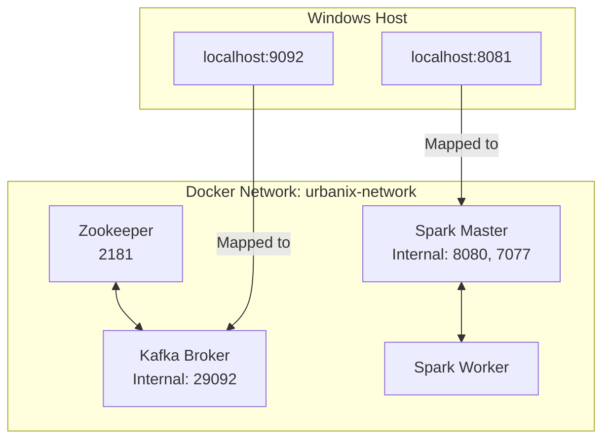

# Urbanix — Day 1 Infrastructure Deep-Dive
> From Local Environment Setup to a Verified Kafka + Spark Distributed Foundation

> [!WARNING]
> **TEMPORARY DEVELOPMENT NOTE**
> This document exists to preserve Day 1 learning and implementation history.
> It is intentionally stored under `_day-notes/` and is planned to be removed before final project submission.

---

## 1. Day 1 Objective

**Urbanix** is a Smart City IoT Traffic & Environmental Risk Forecasting Platform built as an academic capstone. It uses distributed systems (Kafka, Spark) to ingest telemetry data and process it with machine learning and graph algorithms.

**Day 1 Objective:** Establish the fundamental infrastructure scaffold upon which the rest of the project will run. We needed a clean monorepo, a robust local Git history, and a completely localized Docker Compose environment running Zookeeper, Kafka, and a standalone Spark cluster.

Infrastructure comes *before* application logic because distributed streaming code (producers, Spark streaming) physically requires a cluster to connect to. Building the cluster first allows us to verify networking and architecture independent of application bugs.

**What was NOT built (Day 1 Boundary):**
- Planned / Discussed — Not Implemented on Day 1:
  - Python sensor producers
  - Spark Structured Streaming applications
  - Spark SQL
  - MLlib / ML models
  - Scala / GraphX
  - FastAPI
  - The frontend dashboard

---

## 2. Technologies Used

| Technology | Version / Image | Purpose in Urbanix |
| :--- | :--- | :--- |
| **Docker** | Verified working version | Container runtime to run isolated services |
| **Docker Compose** | Verified working version | Multi-container orchestration |
| **Java** | JDK 25.0.2 LTS | JVM ecosystem required for future Spark compatibility |
| **Git** | Verified working version | Version control |
| **Zookeeper** | `confluentinc/cp-zookeeper:7.5.0` | Kafka coordination for this setup |
| **Kafka** | `confluentinc/cp-kafka:7.5.0` | Event streaming/message backbone |
| **Spark** | `apache/spark:3.5.1` | Distributed processing |
| **GitHub** | Repository | Remote version control |

*(Note: Python and Java are not strictly used by the Day 1 containers internally, but are host environment dependencies validated for future days).*

---

## 3. Environment Verification

Before installing infrastructure, we verified the host machine's readiness. 

**Commands Used:**
```cmd
docker --version
docker compose version
python --version
java -version
javac -version
git --version
```
**Explanation:** 
These checks ensure the underlying binaries are in the system `PATH`. A missing dependency (like Docker) would halt the infrastructure before it started.

---

## 4. Java Version Issue / Environment Decision

During initial checks, we found **Java 8** was the active JDK, but **JDK 25.0.2 LTS** and JDK 23 were also installed. 

**Decision:** We selected JDK 25.0.2 LTS for Urbanix.
**Constraint:** We deliberately did **NOT** uninstall Java 8 because it is required for older legacy projects on the machine.

**Why Java matters:** Spark is built on Scala, which runs on the Java Virtual Machine (JVM). A robust JDK is required for Spark development.
**How we switched the session:**
```cmd
set JAVA_HOME=C:\Program Files\Java\jdk-25.0.2
set PATH=%JAVA_HOME%\bin;%PATH%
```
By setting `JAVA_HOME` and prepending it to the `PATH`, we ensure that the command line prioritizes JDK 25 over Java 8 without modifying the system-wide global variables, preserving backward compatibility for other projects.

---

## 5. GitHub + Repository Setup

We chose a **monorepo** structure. A monorepo keeps all services, infrastructure, documentation, and data in a single Git repository. This reduces complexity for an academic capstone, making it easier to track cross-cutting changes (e.g., updating a Kafka topic config alongside the producer code that uses it).

**Top-Level Directories:**
- `services/producers`: Future Python IoT data generators.
- `services/streaming`: Future Spark Structured Streaming logic.
- `services/graphx-reroute`: Future Scala/GraphX routing logic.
- `dashboard`: Future frontend application.
- `infra`: Infrastructure-as-code (Docker Compose).
- `data`: Local data storage.
- `docs`: Official project documentation.
- `.github/workflows`: Future CI/CD pipelines.

*Note: Most application directories are currently placeholders.*

---

## 6. Git History

We deliberately used meaningful **Conventional Commits** rather than artificial/no-op commits.

The defining commit of Day 1 Infrastructure was:
`78e4c29 feat(infra): add local Kafka and Spark cluster`

**Why it matters:** This commit cleanly scopes the introduction of the entire Docker infrastructure. It was pushed directly to `origin/main` from a clean working tree. Prior to this, several `docs:` and `chore:` commits were used to scaffold the initial directories and establish polished `README.md` files for every module.

---

## 7. Docker Fundamentals

- **Docker image:** A read-only template with instructions for creating a Docker container (e.g., `apache/spark:3.5.1`).
  - *Data Science analogy:* A frozen Anaconda environment or a `.pkl` model file.
- **Docker container:** A runnable instance of an image (e.g., `spark-master`).
  - *Data Science analogy:* An actively running Jupyter Notebook kernel utilizing that environment.
- **Docker Compose:** A tool for defining and running multi-container Docker applications.
  - *Real-world analogy:* A musical conductor coordinating different musicians (containers) to play a song together.
- **Docker network:** An isolated virtual network that allows containers to talk to each other securely.
- **Container port:** The port exposed *inside* the isolated container.
- **Host port:** The port exposed on the Windows machine, mapped to the container port.

---

## 8. Urbanix Day 1 Architecture

### Mermaid Diagram


### ASCII Diagram
```text
Windows Host
 │
 ├── localhost:9092 → Kafka
 │
 └── localhost:8081 → Spark Master UI
 │
Docker Network (urbanix-network)
 │
 ┌───────────────┼────────────────┐
 │               │                │
Zookeeper      Kafka         Spark Master
                 │                │
                 │           Spark Worker
 └───────────────┴────────────────┘
```

---

## 9. Zookeeper

**What it is:** A centralized service for maintaining configuration information, naming, and providing distributed synchronization.
**Why we use it:** Our specific Kafka image (`confluentinc/cp-kafka:7.5.0`) uses Zookeeper to manage broker state, leader election, and metadata. 
**Port:** `2181`
*Why no KRaft?* While Kafka is moving towards Zookeeper-less architectures (KRaft), this specific stable Confluent image utilizes Zookeeper. We are optimizing for Day 1 stability.

---

## 10. Kafka Broker

- **Broker:** A single Kafka server that stores and serves messages.
- **Producer:** An application that writes data to Kafka. *(Planned - Not Implemented)*
- **Consumer:** An application that reads data from Kafka. *(Planned - Not Implemented)*
- **Topic:** A named category/feed to which messages are published.
- **Partition:** A topic is split into partitions for horizontal scaling.
- **Replication Factor:** How many copies of data exist across brokers.
- **Leader:** The broker actively handling reads/writes for a partition.
- **ISR (In-Sync Replica):** Replicas that are fully caught up with the leader.

*Example:* A Python Traffic Sensor (Producer) will write to `traffic-topic` stored on the Kafka Broker, to be read later by a Spark Streaming Consumer.

---

## 11. Why Three Kafka Topics?

Urbanix uses three distinct topics:
1. `traffic-topic`
2. `aqi-topic`
3. `weather-topic`

**Why?** Logical separation. Traffic flow is structurally different from weather metrics. Putting them in one topic would require consumers to unpack and filter irrelevant data continually. Separate topics allow independent consumers to scale differently.

---

## 12. Kafka Partitions + Replication

**Day 1 Configuration:**
- `PartitionCount: 1`
- `ReplicationFactor: 1`

**Why?** Partitions enable parallelism (multiple consumers reading at once). Because we are building a *local standalone cluster* with only one broker, we only need 1 partition and 1 replica. In a production cluster with 3 brokers, we might have 3 partitions and a replication factor of 3 to survive node failure.

---

## 13. Kafka Networking — Important

**KAFKA_LISTENERS vs KAFKA_ADVERTISED_LISTENERS**

- `KAFKA_LISTENERS`: The physical network interfaces and ports the Kafka process actually binds to.
  - `PLAINTEXT://0.0.0.0:29092,PLAINTEXT_HOST://0.0.0.0:9092`
- `KAFKA_ADVERTISED_LISTENERS`: The metadata returned to clients telling them *how to connect*.
  - `PLAINTEXT://kafka:29092,PLAINTEXT_HOST://localhost:9092`

**Internal Communication:** A Spark container asks Kafka to connect on the internal Docker network. Kafka replies "Connect to `kafka:29092`". The container resolves `kafka` to the container IP and succeeds.
**External Communication:** A Python script on Windows asks Kafka to connect. Kafka replies "Connect to `localhost:9092`". The script resolves `localhost` via Windows networking, hitting the Docker port mapping, and succeeds.

---

## 14. Spark Master

The **Spark Master** (`apache/spark:3.5.1`) coordinates the cluster. It manages resources and schedules tasks.
- **Master URL:** `spark://spark-master:7077` (Used by workers to register).
- **Port 7077:** Internal RPC communication.
- **Web UI:** Allows visual monitoring of cluster health.
*Note: The master does not execute the actual analytic application code; it only delegates it.*

---

## 15. Spark Worker

The **Spark Worker** listens to the Master and executes the assigned data processing tasks.
- **Registration:** Uses `SPARK_MASTER_URL=spark://spark-master:7077` to introduce itself to the master.
- **Day 1 Limits:** We configured it to use `1G` RAM and `1` core to remain lightweight for local development.

---

## 16. Spark Driver

*Planned / Discussed — Not Implemented on Day 1*

The **Driver** is the process where the user's `main()` method runs. It coordinates the actual Spark application (the code), whereas the Master coordinates the cluster (the hardware/containers).

```text
Spark Application  -->  Driver  -->  Spark Master  -->  Spark Worker(s)
```

---

## 17. Docker Compose File — Line By Line

- `services:` Defines the containers.
- `zookeeper:` Our cluster state manager.
- `kafka:` Our broker, heavily configured with environment variables for networking.
- `depends_on:` Ensures Zookeeper starts *before* Kafka, and Master *before* Worker. (Controls startup order, NOT application readiness).
- `spark-master` & `spark-worker:` Uses official `apache/spark:3.5.1` and calls `spark-class org.apache.spark.deploy...` commands.
- `networks:` Places all containers on an isolated `bridge` network called `urbanix-network`.

---

## 18. Actual Compose Configuration

```yaml
version: '3.8'

services:
  zookeeper:
    image: confluentinc/cp-zookeeper:7.5.0
    container_name: zookeeper
    environment:
      ZOOKEEPER_CLIENT_PORT: 2181
      ZOOKEEPER_TICK_TIME: 2000
    networks:
      - urbanix-network

  kafka:
    image: confluentinc/cp-kafka:7.5.0
    container_name: kafka
    depends_on:
      - zookeeper
    ports:
      - "9092:9092"
    environment:
      KAFKA_BROKER_ID: 1
      KAFKA_ZOOKEEPER_CONNECT: 'zookeeper:2181'
      KAFKA_LISTENER_SECURITY_PROTOCOL_MAP: PLAINTEXT:PLAINTEXT,PLAINTEXT_HOST:PLAINTEXT
      KAFKA_LISTENERS: PLAINTEXT://0.0.0.0:29092,PLAINTEXT_HOST://0.0.0.0:9092
      KAFKA_ADVERTISED_LISTENERS: PLAINTEXT://kafka:29092,PLAINTEXT_HOST://localhost:9092
      KAFKA_INTER_BROKER_LISTENER_NAME: PLAINTEXT
      KAFKA_OFFSETS_TOPIC_REPLICATION_FACTOR: 1
      KAFKA_TRANSACTION_STATE_LOG_REPLICATION_FACTOR: 1
      KAFKA_TRANSACTION_STATE_LOG_MIN_ISR: 1
    networks:
      - urbanix-network

  spark-master:
    image: apache/spark:3.5.1
    container_name: spark-master
    command: /opt/spark/bin/spark-class org.apache.spark.deploy.master.Master
    ports:
      # Note: Spark internally uses port 8080.
      # Host port 8081 is used because host port 8080 is already occupied on this development machine.
      # This does NOT change Spark's internal port.
      - "8081:8080"
      - "7077:7077"
    networks:
      - urbanix-network

  spark-worker:
    image: apache/spark:3.5.1
    container_name: spark-worker
    depends_on:
      - spark-master
    command: /opt/spark/bin/spark-class org.apache.spark.deploy.worker.Worker spark://spark-master:7077 -m 1G -c 1
    networks:
      - urbanix-network

networks:
  urbanix-network:
    driver: bridge
```

---

## 19. Port Mapping

- **Kafka:** `localhost:9092` (Host) → `9092` (Container)
- **Spark Master UI:** `localhost:8081` (Host) → `8080` (Container)
- **Spark Master RPC:** `localhost:7077` (Host) → `7077` (Container)

---

## 20. Important 8080 → 8081 Issue

**The Problem:** The Day 1 specification demanded the Spark UI map to `localhost:8080`. However, when starting Docker, a port conflict occurred:
`Error response from daemon: ports are not available: exposing port TCP 0.0.0.0:8080 -> 127.0.0.1:0: listen tcp 0.0.0.0:8080: bind`

**Investigation:** We identified that `java.exe` (PID 7700) running as a Windows Service was actively holding `0.0.0.0:8080`.

**The Solution:** Rather than killing an unknown critical Windows service, we applied the smallest safe fix: mapping the host port to `8081` (`"8081:8080"`). 
*Note: Spark internally still believes it is running on 8080. Only Windows routes 8081 to it.*

---

## 21. Validation Commands

```cmd
# Validates the YAML file syntax
docker compose -f infra/docker-compose.yml config

# Starts the cluster in detached (background) mode
docker compose up -d

# Verifies running containers
docker ps

# Creates topics via Kafka internal CLI
docker exec kafka kafka-topics --create --topic traffic-topic --bootstrap-server kafka:29092 --partitions 1 --replication-factor 1
docker exec kafka kafka-topics --create --topic aqi-topic --bootstrap-server kafka:29092 --partitions 1 --replication-factor 1
docker exec kafka kafka-topics --create --topic weather-topic --bootstrap-server kafka:29092 --partitions 1 --replication-factor 1

# Verifies topics
docker exec kafka kafka-topics --describe --bootstrap-server kafka:29092
```

---

## 22. Actual Validation Results

We strictly validated the deployment:
- Exactly 4 containers (`kafka`, `zookeeper`, `spark-master`, `spark-worker`) running.
- `traffic-topic`, `aqi-topic`, and `weather-topic` successfully created.
- Each topic showed `PartitionCount: 1` and `ReplicationFactor: 1`.
- Spark Master logs showed: `INFO Master: Registering worker 172.22.0.5:42159 with 1 cores, 1024.0 MiB RAM` (exactly 1 worker recognized).
- Spark UI was confirmed accessible at `http://localhost:8081`.

---

## 23. What Each Container Does

| Container | Role | Important Port | Communicates With |
| :--- | :--- | :--- | :--- |
| **zookeeper** | Cluster metadata manager | `2181` | Kafka |
| **kafka** | Message broker | `9092` / `29092` | Zookeeper, Producers, Consumers |
| **spark-master** | Cluster resource coordinator | `7077`, `8080` (Internal) | Spark Worker, Driver |
| **spark-worker** | Task execution engine | N/A | Spark Master |

---

## 24. End-To-End Day 1 Flow

1. Docker creates `urbanix-network`.
2. Zookeeper and Spark Master boot simultaneously.
3. Kafka boots (waiting for Zookeeper via `depends_on`).
4. Spark Worker boots (waiting for Master via `depends_on`).
5. Worker registers itself with Master over internal RPC `7077`.
6. Developer executes CLI scripts inside the Kafka container to create topics.
7. Infrastructure is verified and ready.
*(No sensor data flows yet).*

---

## 25. What We Did Not Build (Day 1 Boundary)

- **Producers:** Postponed. Infrastructure must exist before producers can send data.
- **Spark Structured Streaming:** Postponed. Awaiting real telemetry topics.
- **MLlib/GraphX:** Postponed. Requires streaming data pipelines to feed them.
- **Dashboard:** Postponed. UI comes last after backend is verified.

---

## 26. Day 1 Troubleshooting

**Issue 1: Missing Image Tags**
- Attempted to pull `bitnami/spark:3.5.1`. Docker returned `not found`. 
- **Fix:** Pivoted to the official `apache/spark:3.5.1` and manually configured the entrypoint scripts to ensure stability.

**Issue 2: Port 8080 Conflict**
- Spark Master UI host mapping failed because a background Java service owned `8080`.
- **Fix:** Altered Docker Compose to use `8081:8080` without touching the host's background services.

---

## 27. Lessons Learned

- **Startup Ordering vs Readiness:** `depends_on` tells Docker when to start a container, but it does NOT guarantee the application inside (like Kafka) is actually ready to receive traffic.
- **Advertised Listeners:** Kafka's internal networking is complex. It must explicitly tell clients *how* to route to it via `ADVERTISED_LISTENERS`, differentiating between Docker network IPs and localhost.
- **Host vs Container Ports:** A port conflict on the host (`8080`) can be easily circumvented by mapping a different host port (`8081`) to the same internal container port (`8080`), completely isolating the application from host OS issues.

---

## 28. Viva / Interview Questions

1. **What is Docker?** A platform to build and run isolated applications in containers.
2. **Image vs Container?** Image is a blueprint; container is a running instance.
3. **Why Docker Compose?** It manages complex multi-container architectures declaratively in YAML.
4. **What is a Kafka broker?** A server that receives, stores, and serves message streams.
5. **What is a Kafka topic?** A named category where specific types of messages (e.g., traffic data) are stored.
6. **What is a partition?** A subset of a topic's data, allowing horizontal scaling and parallel processing.
7. **Why one partition on Day 1?** We are running a single-broker local development setup; parallelism isn't required yet.
8. **What is replication factor?** The number of copies of data stored across brokers for fault tolerance.
9. **Why replication factor 1?** We only have one broker, so data cannot be replicated elsewhere.
10. **What does Zookeeper do here?** It manages the Kafka broker's state and leader election.
11. **What is a Kafka advertised listener?** The routing metadata Kafka hands to clients so they know how to connect.
12. **Why `kafka:29092`?** It's the internal Docker DNS name and port for containers communicating with Kafka.
13. **Why `localhost:9092`?** It's the external mapping for Windows host applications to hit the container.
14. **What is a Spark master?** The node that coordinates resources across the Spark cluster.
15. **What is a Spark worker?** The node that executes processing tasks assigned by the master.
16. **What is a Spark driver?** The process running the user's main application logic.
17. **Why are master and driver different?** The master manages hardware/cluster resources; the driver manages application execution.
18. **Why is Spark UI on 8081 on this machine?** A background Windows Java service was already occupying port 8080.
19. **What does `8081:8080` mean?** Map host port 8081 to internal container port 8080.
20. **What exactly was accomplished on Day 1?** Established the complete foundational infrastructure (Kafka, Spark) required to process Urbanix data.

---

## 29. Quick Command Cheat Sheet

**Docker / Compose**
```cmd
docker compose config
docker compose up -d
docker ps
```
**Kafka Verification**
```cmd
docker exec kafka kafka-topics --create --topic traffic-topic --bootstrap-server kafka:29092 --partitions 1 --replication-factor 1
docker exec kafka kafka-topics --describe --bootstrap-server kafka:29092
```

---

## 30. Final Day 1 Checklist

- [x] Environment verified
- [x] Java environment prepared
- [x] GitHub repository established
- [x] Monorepo scaffolded
- [x] Documentation layer created
- [x] Docker Compose infrastructure created
- [x] Zookeeper running
- [x] Kafka running
- [x] Spark Master running
- [x] Spark Worker running
- [x] Three Kafka topics created
- [x] Topic partition/replication verified
- [x] Spark worker registered
- [x] Infrastructure committed
- [x] Infrastructure pushed to GitHub
- [x] Working tree clean

---

## 31. Day 1 Final State

**Final Repository Tree (Relevant to Day 1):**
```text
urbanix/
├── infra/
│   ├── docker-compose.yml
│   └── README.md
├── _day-notes/
│   └── day-01/
│       └── DAY_01_INFRASTRUCTURE_REPORT.md
└── README.md
```

**Git State:**
```text
78e4c29 (HEAD -> main, origin/main, origin/HEAD) feat(infra): add local Kafka and Spark cluster
```
**Status:** Day 1 is COMPLETE.

---

## 32. Next Day Preview

**Day 2: Sensor Simulation Layer**
We will build the Python IoT data generators.
*Future Flow:* Python sensor producers → write to `traffic-topic`, `aqi-topic`, `weather-topic` → Kafka broker.
